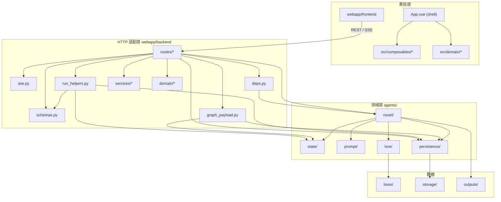

# 架构说明

本文集中说明**模块关系、依赖方向、数据真源、主请求链路、产品行为摘要与重构/联调清单**。各子目录下的 `README.md` 只描述**该目录内每个文件做什么**，不重复展开整体设计。

---

## 文档地图

| 文档 | 内容定位 |
|------|-----------|
| [`README.md`](./README.md) | 用于对外界发布源码，展示技术力即可。安装、密钥、启动、产品简介、设计目标与能力摘要、运行模式、数据资产与接口速览、实践建议、许可证 |
| **本文 `ARCHITECTURE.md`** | 分层、入口、链路、真源、接口摘要、联调与工程建议 |
| [`agents/README.md`](./agents/README.md) | `agents/` 下各文件职责列表 |
| [`webapp/backend/README.md`](./webapp/backend/README.md) | 后端各文件职责、启动与环境变量 |
| [`webapp/backend/routes/README.md`](./webapp/backend/routes/README.md) | 路由层边界（薄路由约定）与文件职责 |
| [`webapp/backend/services/README.md`](./webapp/backend/services/README.md) | 后端服务编排层职责（本次 novels 拆分落点） |
| [`webapp/backend/domain/README.md`](./webapp/backend/domain/README.md) | 后端领域规则层职责 |
| [`webapp/frontend/README.md`](./webapp/frontend/README.md) | 前端各文件职责、npm 命令 |
| [`webapp/frontend/src/README.md`](./webapp/frontend/src/README.md) | 前端 `src` 分层（壳层 / composables / domain） |
| [`webapp/frontend/src/composables/README.md`](./webapp/frontend/src/composables/README.md) | 前端可复用状态与行为编排职责 |
| [`webapp/frontend/src/domain/README.md`](./webapp/frontend/src/domain/README.md) | 前端领域纯函数职责 |
| [`storage/README.md`](./storage/README.md) | `storage/` 路径与**字段级**规范、表间关联 |
| [`TOURMAP.md`](./TOURMAP.md) | 功能进度与路线图（非架构细则） |

---

## 1. 设计目标

- **连续性优先**：写作由状态机长期演进，而非单次生成。
- **设定优先**：设定文件化、标签化、可控注入，减少设定漂移。
- **可观测优先**：输入预览、阶段事件、token 消耗可见。
- **失败可恢复**：结构化输出与 patch 合并，降低长输出崩溃风险。

---

## 2. 三条运行时入口（务必区分）

| 入口 | 启动方式 | 是否走 `NovelAgent` 全链路 |
|------|----------|----------------------------|
| **Web 主线** | `python -m uvicorn webapp.backend.server:app` | 是：plan/write、state、图谱四表、Lore 摘要注入等 |
| **CLI** | `python -m cli` | **否**：`LoreLoader` 读 md 原文 + LangChain 多轮对话，无章节状态机 |
| **Mobile** | `mobile/`（Flet） | **否**：本地 md 扫描 + 直连 DeepSeek HTTP，与 Web 存储无关 |

CLI 与 Mobile 在提示词、读 md 方式上与 Web **产品层相似**，但**不是** `agents/novel` 的重复实现。

---

## 3. Web 主线：逻辑分层与依赖方向

**原则**：越往上越贴近 HTTP/UI；越往下越贴近领域与磁盘。`routes` 保持薄，编排下沉到 `webapp/backend/services`，规则下沉到 `webapp/backend/domain`，核心 LLM/状态机仍在 `agents/`。



**依赖约定（重构后）**

- `routes/*`：路径、校验、`HTTPException`、调用下层；**不写**与传输无关的算法。
- `services/*`：承接路由下沉的流程编排与可复用逻辑（例如 `auto_lore.py`、`novel_run.py`）。
- `domain/*`（backend）：放规则函数（例如 `novel_lore_tags.py`），避免混入 HTTP 细节。
- `run_helpers.py`：无 FastAPI；可依赖 `agents.persistence`、`agents.state.state_models`、`webapp.backend.schemas`。
- `graph_payload.py`：只读聚合；写入由 `routes/graph.py` 调 `agents.persistence.graph_tables`。
- `frontend/src/App.vue`：壳层组装；可复用逻辑优先进 `src/composables/*`，纯规则优先进 `src/domain/*`。
- **`agents` 内部**：
  - `state.state_compactor` → `persistence.graph_tables`（只读邻居）。
  - `state.state_merge` → `persistence.storage`（只读 `list_chapters`）。
  - `novel.*` → `persistence` / `lore` / `state` / `prompt` / `text_utils`。
  - `persistence.graph_tables` → `storage` + `state_models`。
  - `lore` **不得**依赖 `novel`。
  - `state/__init__.py` **仅**导出 `state_models`，避免与 `storage` / `compactor` 循环导入。

---

## 4. 系统能力与行为摘要

### 4.1 叙事状态（`NovelState`）

- 人物（关系、目标、事实、位置）、世界规则、阵营、开放问题、**时间线 `world.timeline`**、连续性（`time_slot` / POV / 出场）。
- 运行态落盘：`storage/novels/<novel_id>/novel.db` 中 `novel_state` 行。
- **人物/事件关系的事实源**在四表，不是 `novel_state` 里可随意手改的关系字段（见第 7 节）。

### 4.2 写作链路（Plan + Draft）

- `plan_chapter` → `ChapterPlan`；`write_chapter_text(_stream)` 流式正文。
- 章节结构化：`novel.db` 的 `chapters` 表；正文归档：`outputs/<novel_title>_<novel_id前缀>/*.txt`。

### 4.3 Lore 摘要与注入

- 摘要由 LLM 生成；缓存粒度 **单 tag**，模式 `llm_tag_v1`。
- 运行使用 `lore_tags`；注入：优先 tag 摘要缓存，未命中则该 tag 原文。

### 4.4 上下文压缩（`compact_state_for_prompt`）

- 默认仅注入相邻相关两章；`time_slot_override` 时不注入章节 JSON 上下文；章节 `content` 不作为核心上下文以控制 token。
- **未归属已有时间线事件**（无 `focus_timeline_event_id`）时：不按 `time_slot_hint` 对整条时间线做子串扫描，仅保留末尾 `timeline_n` 条。
- **新建事件**（`new_event_time_slot` + `new_event_summary` 且未选已有 `ev:timeline`）：规划/正文压缩里 `world.timeline` 可为空数组；优化/下章建议等仍可按原逻辑带时间线摘要。

### 4.5 可观测性与前端主流程

- SSE 阶段：`planning` → `writing` → `saving` → `done` 等（与 `run_stream` 实现一致）。
- `run_stream` 观测字段：`start/phase/done/error` 统一携带 `request_id`；`error` 帧含 `phase` 与 `error_code`，便于回归记录与故障归因。
- **先 Input 预览，再确认运行**；`/preview_input` 可看本次拼装（不调模型）。
- 图谱视图：`people` / `events` / `mixed`；全屏编辑走 `PATCH /api/novels/{id}/graph/*`。
- 图谱管理增强：全屏图谱支持**节点/边类型筛选**、`只看孤立节点`、命中计数与前后跳转搜索、创建节点后自动聚焦、导出 JSON 快照（含统计信息）。
- 前端布局快改版：左栏上下文 + 中栏导演工作台 + 运行抽屉。中栏 Step1~Step4 为单屏工作流，手动流转，阶段完成后高亮“下一步”，非当前步骤默认隐藏。
- 图谱双形态：中栏 `GraphSliceCard` 作为轻量上下文视图；复杂编辑进入全屏 `GraphDialogs` 工作室。
- 主题：`theme-literary.css` + Noto Serif SC；下章续写改为右栏「下章建议」内联编辑与生成（不再弹窗）；可选 **当前地图** → `RunModeRequest.current_map` → `run_helpers.build_llm_user_task`。
- Step3 任务为空时会自动推测一版可编辑任务草案，作者最终确认。
- SSE `done` 可带 `chapter_timeline_event_id`，前端据此切到「归属已有事件」；失败则回退拉 `state` + 当前章 JSON 或提示手选。
- 一致性审计 v2：`done.consistency_audit` 包含 `block_reasons` 与 `recommended_actions`，高危时可阻断自动续写。
- 结构卡门禁：`preview_input`/`run(_stream)` 返回 `structure_gate`；最小结构项未满足需 `structure_risk_ack=true` 才继续运行。
- 影子编导 v2：`preview_input`/`run(_stream)` 返回 `shadow_director`；前端可自动接管细节（推荐配角/冲突类型/伏笔回收）并支持撤销。
- `GET /api/novels/{id}/state` 附带 `outputs.root_dir / outputs.novel_subdir / outputs.novel_output_dir`，前端运行面板可稳定展示当前小说输出目录（不依赖最近一次写入事件）。
- 图谱治理 MVP：全屏图谱支持“孤立节点 / 断链时间线”逐个定位；后端新增批量删边接口（按边类型 + source/target 节点类型过滤）。

### 4.6 运行模式（`RunModeRequest.mode`）

| Mode | 语义 |
|------|------|
| `init_state` | 初始化世界（写作链路不会自动初始化） |
| `plan_only` | 仅规划并推进状态 |
| `write_chapter` | 规划 + 正文 + 落盘 |
| `revise_chapter` | 修订（当前沿用规划+写作链路） |
| `expand_chapter` | 扩写（规划+写作，`write` 为 expand 模式） |
| `optimize_suggestions` | 优化建议（独立 prompt/流式，不经 plan/write 章节落盘主链） |

`state.meta.initialized=false` 时写作链路报错，需先 `init_state`。

---

## 5. 主请求链路（Web）

### 5.1 `preview_input` / `run_stream`

1. 前端 `RunModeRequest` 与 `schemas.py` 对齐。
2. `routes/novels.py`（薄路由）做请求映射，调用 `run_helpers.py` 与 `services/*`（如 `services/novel_run.py`、`services/auto_lore.py`）完成编排。
3. `NovelAgent.preview_input` / `run`；流式经 `sse.py`。`preview_input` 除输入分阶段预览外，还返回 `structure_gate`、`shadow_director`、`suggested_timeline_event_id/label`，供前端低打断自动采纳与风险确认。
4. 落盘在 `agents` 的 `persistence` / `graph_tables`；路由可做跑后事件同步（如 `_sync_after_run_if_event`）。

#### Event Plan Dedicated Flow（事件计划专门流程）

- **统一流程**：`绑定已有 timeline_event` -> `生成/重生成 event_plan` -> `管理器复核` -> `preview_input` -> `run/run_stream`。
- **硬门禁**（后端真源）：
  - 未绑定已有事件：拒绝写作类运行（`event binding required`）。
  - 绑定了事件但缺失事件计划：拒绝写作类运行（`event plan missing`）。
- **前端职责**：
  - 工作台提示并引导到事件计划管理。
  - 在“预览/运行”前阻止无绑定/无计划的请求提交。
- **约束原则**：保持 event-only，不回退到隐式 chapter-level 规划。

### 5.2 图谱

- **读**：`GET .../graph` → `graph_payload.build_novel_graph_payload`。
- **写**：`PATCH .../graph/*` → `routes/graph.py` + `graph_tables` / `save_state`。

### 5.3 Lore API

- `routes/lore.py` → `NovelAgent.build_lore_summary_llm`、`LoreLoader`、`lore_summary`；路由保持极薄。

### 5.4 典型章节与持久化顺序（实现共识）

- `load_state`：合并最新章到 continuity/meta；`ensure_timeline_stable_ids` 等。
- `persist_chapter_artifacts`：章节行 → `novel_state` → 同步实体表 → 本章 `appear` / `chapter_belongs` → `timeline_next` 等（详见 [`storage/README.md`](./storage/README.md) 第 9 节）。
- 人物关系编辑：写 `character_relations` 表，读 state 时 `hydrate_state_character_relationships`。

### 5.5 REST 与 SSE 摘要

| 方法 | 路径 | 作用 |
|------|------|------|
| POST | `/api/lore/summary/build` | 构建 tag 摘要 |
| GET | `/api/lore/summary/{summary_id}` | 读取已缓存摘要 |
| GET | `/api/lore/tags` | 标签列表与分组 |
| GET | `/api/lore/preview` | tag 预览（`compact=1` 走摘要缓存） |
| POST/PATCH/DELETE/PUT | `/api/lore/tags*` | Tag 管理（新建、重命名、删除、更新内容） |
| POST | `/api/lore/tags/batch_delete` / `/api/lore/tags/batch_replace_prefix` | Tag 批量删除 / 批量前缀迁移（并同步小说绑定） |
| POST | `/api/novels/{id}/preview_input` | 组装输入预览 |
| GET | `/api/novels/{id}/state` | 读取状态（含 outputs 目录元信息） |
| POST | `/api/novels/{id}/run` | 非流式运行 |
| POST | `/api/novels/{id}/run_stream` | SSE 流式运行 |
| GET 等 | `/api/novels/{id}/graph` 及子路径 | 读图；`PATCH/POST/DELETE` 编辑节点、边、时间线邻接等（见 `routes/graph.py`） |
| POST | `/api/novels/{id}/graph/edges/batch-delete` | 按边类型 + 端点节点类型批量删边（治理场景） |

环境变量：`SKIP_FRONTEND_BUILD=1` 跳过后端启动时的 `npm run build`。详见 [`webapp/backend/README.md`](./webapp/backend/README.md)。

---

## 6. `webapp/` 目录布局

```text
webapp/
├── backend/      # FastAPI
├── frontend/     # Vue/Vite → dist/
├── templates/    # 入口 HTML 回退
└── static/       # 静态资源
```

---

## 7. 数据真源（防串源）

字段级说明见 [`storage/README.md`](./storage/README.md)。

| 数据 | 真源 |
|------|------|
| 章节正文与章内结构化 | `novel.db` → `chapters` 表（`ChapterRecord` JSON） |
| 时间线事件列表与稳定 `event_id` | `novel_state` → `world.timeline`（与 `event_entities` 同步） |
| 人物实体画像 | `character_entities` 表 |
| 人物关系边 | `character_relations` 表 |
| 时间推进、出场、章节归属等 | `event_relations` 表 |
| 运行态连续性（给模型） | `novel_state`（关系以关系表为准） |
| 设定原文 | `lores/**/*.md` |
| Tag 摘要缓存 | `storage/lore_summaries/*.json` |

---

## 8. 模块边界（避免重复实现）

- `routes/` 与 `agents/`：不重复；HTTP 壳 vs 领域。
- `run_helpers` 与 `novel_agent`：`infer_time_slot`、`build_llm_user_task` 等只放在 `run_helpers`（及测试），不要在 `novel_agent` 再写一套。
- `graph_payload` 与 `graph_tables`：只读视图 vs 读写规范。

---

## 9. 按修改类型的联动清单

| 修改点 | 建议同步检查 |
|--------|----------------|
| `agents/state/state_models.py` | `persistence/storage.py`、`graph_tables.py`、`webapp/backend/schemas.py`、`routes/*.py`、前端 payload |
| `NovelAgent` 入参或 `run` | `schemas.py`、`routes/novels.py`、`frontend` 表单与 `api/client.ts` |
| `state_compactor` 或 `prompt_builders` | `preview_input` 与实际 `run` 一致 |
| `persistence/graph_tables.py` | `routes/graph.py`、`graph_payload.py`、前端图谱 |
| `run_helpers.infer_time_slot` 等 | `tests/test_time_slot_infer.py` |
| REST / 请求体字段 | OpenAPI、前端类型、SSE 事件名（若相关） |
| 图谱 JSON 形状 | `graph_payload.py`、`useGraph.ts` |
| `frontend_assets.py` | Windows `npm.cmd`、根 README 启动说明 |

### 9.1 前后端字段联调（速查）

- 请求体与枚举：`schemas.py`、`routes/novels.py`、`novel_agent.py`、表单字段。
- 预输入建议字段：`preview_input` 响应中的 `suggested_timeline_event_id`、`suggested_timeline_event_label`、`structure_gate`、`shadow_director` 与前端导演工作台联动。
- Lore UI：`GET /api/lore/preview`、`POST /api/lore/summary/build`、`GET /api/lore/tags`。
- 图谱 UI：`/api/novels/{id}/graph*`（`routes/graph.py`）。
- 子组件 props：避免对 props 滥用非法 `v-model`（与现有 `model-value` / `update:*` 模式一致）。

---

## 10. 工程实践与常见问题

**实践**

- 先摘要后写作；按章控制任务范围。
- 以四表为关系事实源；图谱先落表再跑 plan/write。
- 新建时间线事件：仅在请求显式选上一/下一事件时写 `timeline_next`；留空不自动按列表邻接补链。

**Token 仍偏高**

- 未命中摘要时 lore 体积大；任务过长会放大注入；可先建 tag 摘要再写章。

---

## 11. 测试与安全

```bash
python -m pytest tests/ -q
```

- 时间段契约：`tests/test_time_slot_infer.py`（经 `webapp.backend.server` 对 `infer_time_slot` 的导出别名）。
- 模块指纹：[`SECURITY_FINGERPRINT.md`](./SECURITY_FINGERPRINT.md）、[`agents/_internal_marks.py`](./agents/_internal_marks.py）；带 `_MODULE_REV` 的变更需登记。

---

## 12. 进度与归档

- 功能进度与 TODO：[`TOURMAP.md`](./TOURMAP.md)。
- 非主路径实验代码：[`discard/README.md`](./discard/README.md)。

---

## 13. 顶层目录索引

| 路径 | 角色 |
|------|------|
| `agents/` | 领域核心 |
| `webapp/backend/` | FastAPI、路由、SSE、helpers、schemas |
| `webapp/frontend/` | Vue 应用 |
| `cli.py` | 终端客户端（非 NovelAgent） |
| `mobile/` | Flet 客户端（非 NovelAgent） |
| `tests/` | 单元测试 |
| `discard/` | 历史/实验 |

架构或行为变更时**优先更新本文**；仅增删某单文件职责时更新对应目录 `README.md`。
