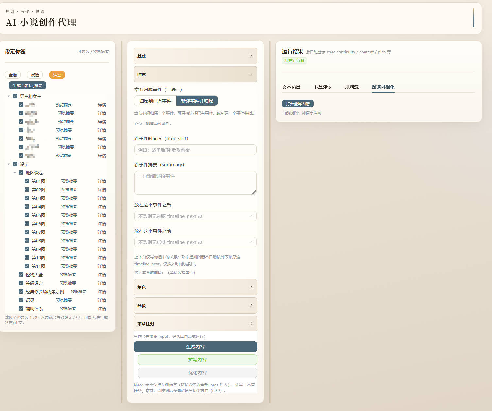
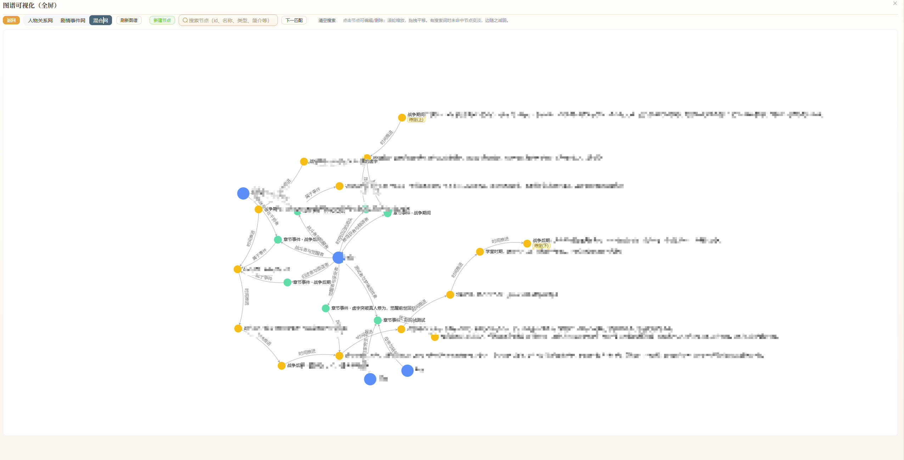

# AI Novel Agent

用于长篇与系列小说创作的写作工作台。系统以 `lores/` 下的 Markdown 设定为输入，通过 `plan -> write -> state update -> persist` 的流程持续产出内容。项目提供 `FastAPI + Vue 3` 的 Web 界面（输入预览、SSE 流式输出、图谱编辑），并提供可选 CLI 与 Flet 移动端示例。

**预览**

| Web 工作台 | 知识图谱 |
|-----------|---------|
|  |  |

---

## 技术栈

| 层级 | 技术 |
|------|------|
| 前端 | Vue 3、TypeScript、Vite、Element Plus、ECharts；可选 Electron 桌面壳 |
| 后端 | Python 3、FastAPI、LangChain（DeepSeek + OpenAI 兼容 API） |
| 领域 | `NovelAgent`、状态压缩与合并、图谱四表持久化、Lore 摘要缓存 |

---

## 快速开始

### 1. 安装依赖

```bash
pip install -r requirements.txt
```

### 2. 配置 API 密钥

统一在 Web 端右上角「API 密钥」里配置并保存（本地 `storage/user_settings.json`）：

- `DeepSeek`：填写 API Key
- `OpenAI 兼容`：填写 API Key + Base URL + Model

当前项目默认按前端/Electron 本地配置生效，不再依赖环境变量优先级。

### 3. 准备设定

将 Markdown 设定放入 `lores/`（相对路径即标签空间，供勾选与注入）。


### 开始（三选一）
####  启动 Web

在**仓库根目录**执行：

```bash
python -m uvicorn webapp.backend.server:app --reload --port 8000
```

浏览器访问：`http://127.0.0.1:8000/`

- 启动时会尝试构建前端（`webapp/frontend` → `dist/`）。若已自行构建或想跳过：设置环境变量 `SKIP_FRONTEND_BUILD=1`。
- 单独开发前端：`cd webapp/frontend && npm install && npm run dev`（代理与端口以 `vite.config.ts` 为准）。

####  终端 CLI

不经过 Web 状态机，仅多轮对话 + Lore 原文注入：

```bash
python -m cli
```

默认使用 DeepSeek **深度思考**模型（`deepseek-reasoner`），终端流式区分「深度思考」与「正文」，会话文件与多轮历史仅保留正文以便 API 兼容。加 `--fast` 可改用 `deepseek-chat`。

####  Electron 桌面壳

[下载地址](https://github.com/HopoZ/ai_agent_novel/releases)

当前 IPC 分支中，Electron 桌面端采用 `preload -> ipcMain -> Named Pipe -> Python worker` 的调用链，不再依赖本地 `127.0.0.1:8000` 页面承载。详情见 `electron/README.md`。

---

## 功能概览

- **先预览再运行**：主流程先调用 `preview_input`，确认后再 `run_stream`，降低误触发与无效 token 消耗。
- **流式输出与中止**：规划、正文、优化建议通过 SSE 分段返回，过程可中止。
- **输入阶段建议**：预输入阶段可给出事件挂载建议，支持一键采用与自动兜底。
- **写前结构校验**：预览阶段补齐并锁定结构卡（目标、冲突、转折、伏笔回收、事件归属）；关键项不足时需二次确认。
- **写后一致性检查**：输出评分、问题、阻断原因和修复动作；包含时间线反转、角色瞬移、关系突变等规则。
- **下一章生成**：在右侧「下章建议」区域直接编辑并生成下一章，复用同一预览链路。
- **自动设定草案**：创建小说时可自动生成 `lores/自动生成/<novel_id>/` 草案，并支持重生成与查看。
- **Tag 管理**：支持新建、重命名、删除、编辑与批量前缀迁移，并同步更新小说绑定的 `lore_tags`。
- **图谱编辑**：支持人物/事件图谱、节点边筛选、搜索、快照导出，以及右键连边与时间线展开。
- **模型列表缓存**：OpenAI 兼容模型列表支持后端 TTL 缓存与前端会话缓存，提供强制刷新与能力标签展示。
- **单屏工作台流程**：中栏 Step1~4 按步骤执行，结果展示在抽屉面板；Step3 任务为空时自动补草案。

---

## 运行模式（`RunModeRequest.mode`）

| 模式 | 说明 |
|------|------|
| `init_state` | 初始化世界（写作前需已初始化） |
| `plan_only` | 仅章节规划并更新状态 |
| `write_chapter` | 规划 + 正文 + 落盘 |
| `revise_chapter` | 修订（沿用规划 + 写作链路） |
| `expand_chapter` | 扩写（写作阶段为 expand） |
| `optimize_suggestions` | 优化建议（独立链路，非整章落盘主链） |

---

## 仓库结构（简）

```text
agents/              # 领域：NovelAgent、状态、提示词、持久化、Lore
webapp/backend/      # FastAPI：路由、SSE、schemas、run_helpers、graph_payload、IPC worker
webapp/frontend/     # Vue 3 工作台源码（桌面端可经 preload IPC 访问后端）
lores/               # 设定 Markdown（可按 .gitignore 决定是否入库）
storage/             # 运行数据、摘要缓存、按小说分目录
outputs/             # 正文归档（按小说分子目录）
cli.py               # 终端入口
electron/            # Electron 壳（Named Pipe IPC 主链 + preload 桥）
mobile/              # Flet 客户端示例
```

---

## 数据与接口（摘要）

持久化要点：

- **单本小说数据**：`storage/novels/<id>/novel.db`（SQLite：`novel_state`、章节行、图谱四表）
- **运行态叙事状态**：`novel_state` 表中的 `NovelState` JSON（人物关系边以四表为准）
- **图谱**：人物/事件实体与关系存于上述 DB，与 API `GET/PATCH/POST/DELETE /api/novels/{id}/graph*` 对应

常用 HTTP 示例：

- `POST /api/lore/summary/build`、`GET /api/lore/tags`、`GET /api/lore/preview`
- `POST /api/novels/{id}/preview_input`、`POST /api/novels/{id}/run_stream`（SSE）
- `POST /api/novels/{id}/run`（非流式 JSON）

完整字段与行为以代码为准：`webapp/backend/schemas.py`、`agents/`、`storage/` 下说明（若仓库中包含对应文档）。

---

## 设计原则（简）

- **连续性**：采用状态机流程，支持多轮写作。
- **设定可控**：Lore 标签化，支持摘要缓存与原文回退。
- **可观测**：阶段事件、token 信息、输入预览可见。
- **稳健性**：结构化输出与合并策略，降低长文本失败概率。

实践建议：先为常用 tag 生成摘要再写章；按章收敛任务；人物与事件关系以图谱表为事实源，再进入生成。

---

## 路线图

功能进度与计划见 [TOURMAP.md](./TOURMAP.md)。

---

## 许可证与作者

- **许可证**：AGPL-3.0-or-later，见 [LICENSE](./LICENSE)。
- **作者**：见 [NOTICE](./NOTICE)。
